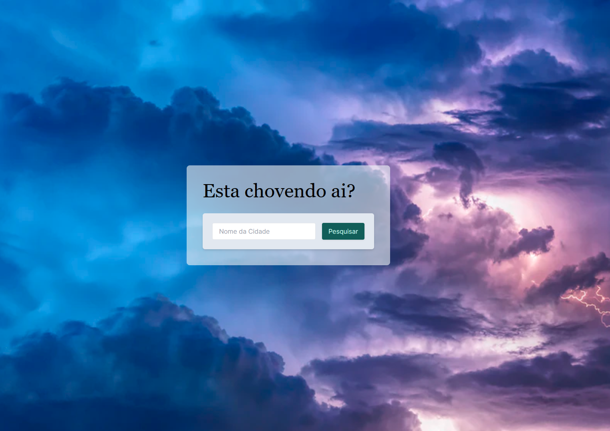

# Esta chovendo ai?

[](https://estachovendoai.vercel.app/)



Site para ver a temperatura e descrição do tempo na cidade informada.

## Objetivo

Esse projeto tem como objetivo praticar o consumo de uma <strong>API</strong> utilizando tecnologias que estou estudando no momento, como <strong>Next</strong> e <strong>Tailwind CSS</strong>.

### Tecnologias utilizadas:

 
 
  
  
  

### Como rodar este projeto?

```bash
npm run dev
# or
yarn dev
# or
pnpm dev
```

Abra [http://localhost:3000](http://localhost:3000) com o seu navegador para ver o resultado.
